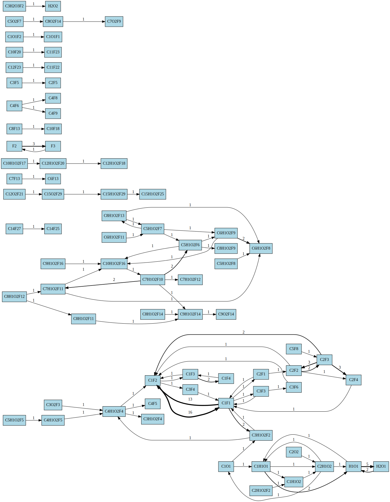
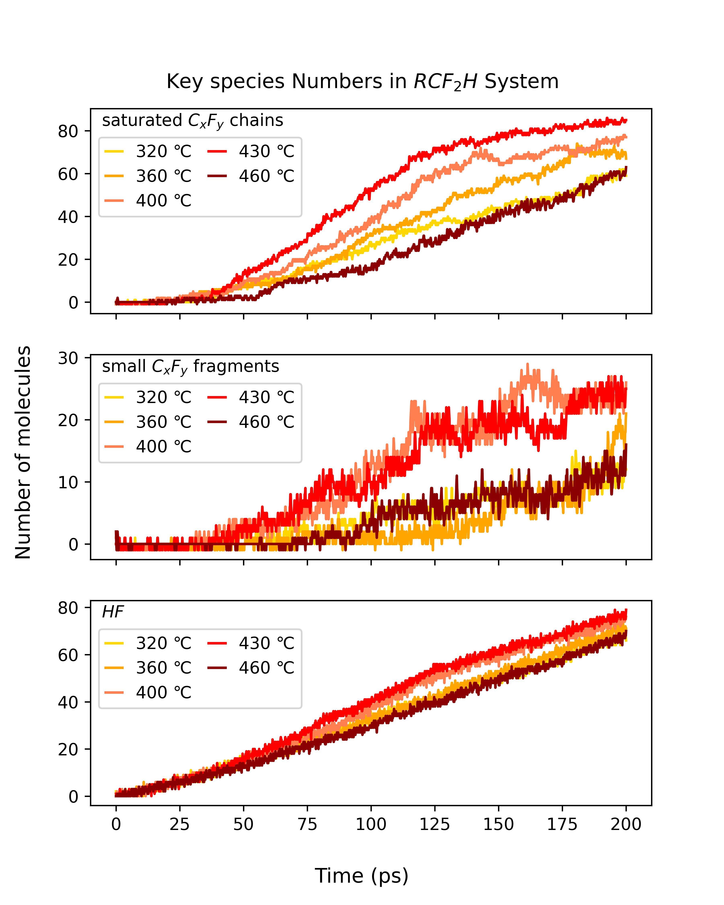
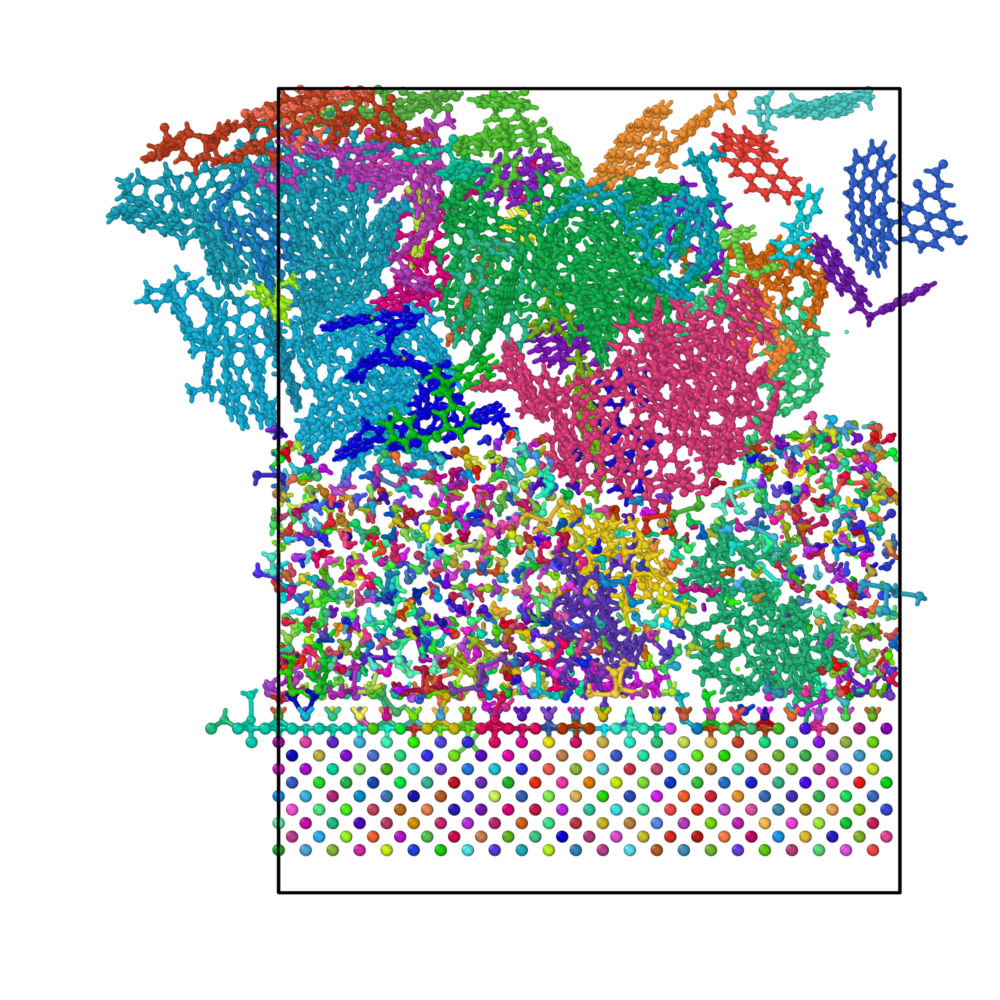

# ReaxTools
[简体中文](README_zh.md)

A high performance reactive MD post-process program
- Compatible for LAMMPS, CP2K or any program writes lammpstrj / xyz files.
- Search system, build molecules and reaction graph accurately.
- High performance, cost < 3 minutes for 1 GB trajectory.

If it's useful to you, please star it on GitHub, which is very important for me. Thank you!  


reaction graph | species | molecule identification
--- | --- | ---
||  |


## Features
-----
- Extremely minimalist tool, no dependencies or installation process required
- Better performance, 10x-50x faster than python script, minimal memory used.
- Read trajectory file: search system, build molecules and reaction graph accurately. 
- Read speices.out file: clean output and make csv table.
- Practical functions for tuning and statistics: customizing bond radius scaling factors, recalculating species weights, organizing molecular groups, reorder elements in formulas

## Usage
---------
(Enter -h to display this help)
```
-f <.xyz/.lammpstrj file> analyze trajectory, search system, build molecules and reaction graphs.  
-s <lammps reaxff/species file (spieces.out)> clean this file and output tables.  

[TRAJ ANALYSIS SETTINGS]  
-t <type_names>, mandatory when using lammpstrj file, split in comma, e.g. C,H,O,N,S,F  
-r <radius_scaling_factor> (default 1.2)  
-nt <num_threads> parallel analyze trajectory (default: 4)
--dump write lammpsdata file for each frame with bonds, may cost more time (default:disabled)

[SPECIES ANALYSIS SETTINGS]  
-me if merge molecules into groups by element number, i.e. group_C1-C4  (default: disabled, when set -mr only, use carbon)
-mr <merge_ranges>, split in comma (default: 1,4,8,16)
-rc rescale group weight by selected element, i.e. C2H4 -> weight 2, C4H8 -> weight 4 (default: disabled)  
--order output formulas in correct element order, split in comma (default: C,H,O,N,S,F,P...)  

[EXAMPLES]  
reax_tools -f traj.lammpstrj -t C,H,O,N,S,F -r 1.2 -nt 4 -me C -rc --dump  
reax_tools -s species.out -me C -mr 1,4,8,16 -rc  
```

### About Reaction Graph

This program outputs a dot file contains nodes and edges for plotting later.  
graphviz is recommended for plotting, to install and use it:  
```
sudo apt install graphviz # or dnf for redhat/fedora...
dot -Tsvg mysystem.dot > mysystem.svg
```
you can view the svg file by web browser or picture viewer

## Example Output
```
(...)
Frame: 97 Atoms: 9800, Bonds: 9291, Mols: 520
Frame: 98 Atoms: 9800, Bonds: 9285, Mols: 524
Frame: 99 Atoms: 9800, Bonds: 9290, Mols: 523
Frame: 100 Atoms: 9800, Bonds: 9290, Mols: 523
Frame: 101 Atoms: 9800, Bonds: 9292, Mols: 520
Merge 27 formulas into grp_C1-3
Merge 19 formulas into grp_C4-7
Merge 38 formulas into grp_C8-15
Merge 15 formulas into grp_>C16
formula                begin     mid     end average
F1                     10.30  175.10  201.30  147.11
F2                    191.20   91.00   66.40  105.81
F3                      1.70    2.60    2.00    2.37
F4                      0.00    0.00    0.00    0.01
H1O1                    0.00    2.10    1.90    2.69
H2O1                    0.00   10.80    8.80    7.44
H2O2                    0.00    0.80    0.00    0.16
H3O2                    0.00    0.00    0.10    0.04
O1                      0.00    0.80    0.00    0.12
grp_>C16                0.10    2.70   11.20    3.66
grp_C1-3                0.30   45.90   53.40   31.82
grp_C4-7                0.80    5.30    6.50    4.35
grp_C8-15             199.80  189.80  171.80  188.78
Save file ../examples/polymer.csv successfully.
=== Reaction Flow Report ===
Total nodes (species): 23
Total edges (reactions): 32

Top reactions:
1: C2F3 -> C2F2 (count: 25)
2: F2 -> F3 (count: 23)
3: C2F2 -> C2F3 (count: 22)
4: F3 -> F2 (count: 13)
5: C2F3 -> C2F4 (count: 11)
6: C2F4 -> C2F3 (count: 10)
7: C1F3 -> C1F2 (count: 10)
8: C1F2 -> C1F3 (count: 8)
9: H1O1 -> H2O1 (count: 7)
10: C1F3 -> C1F4 (count: 7)
Reaction flow graph saved to ../examples/polymer.dot
```

## Future Development Plans
-----------
Make issues on github page for features you want.  

## Build from Source Code
------
You can directly download latest binary program from release page.  

But if you need to build from source:  
```
mkdir build
cd build
cmake ..
cmake --build . -j8
```

Or use Visual Studio / MSVC for windows.  

## License

MIT license  