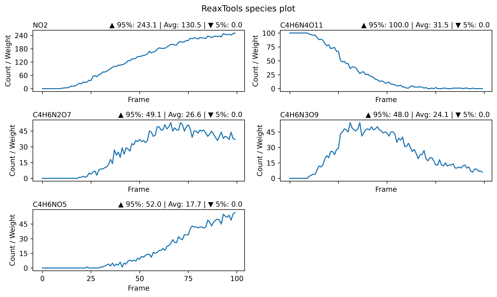
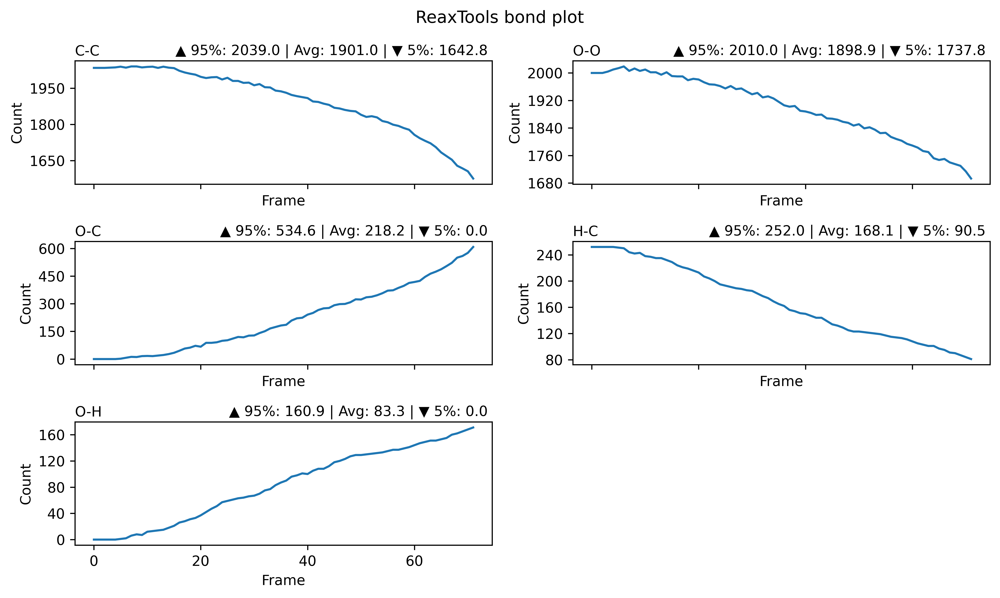
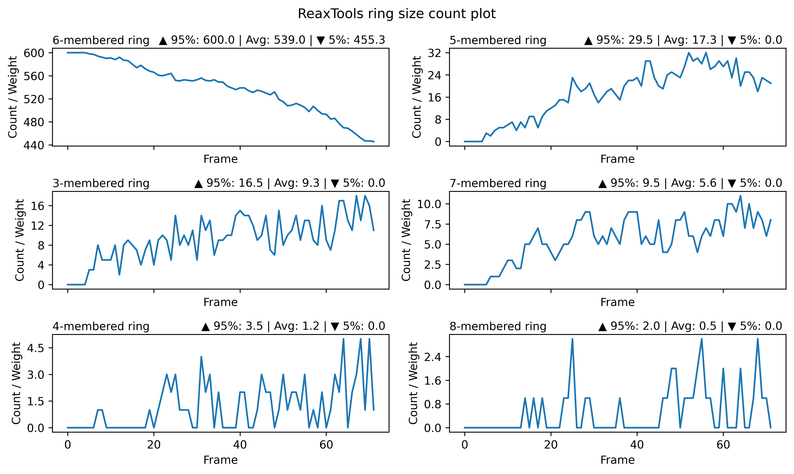
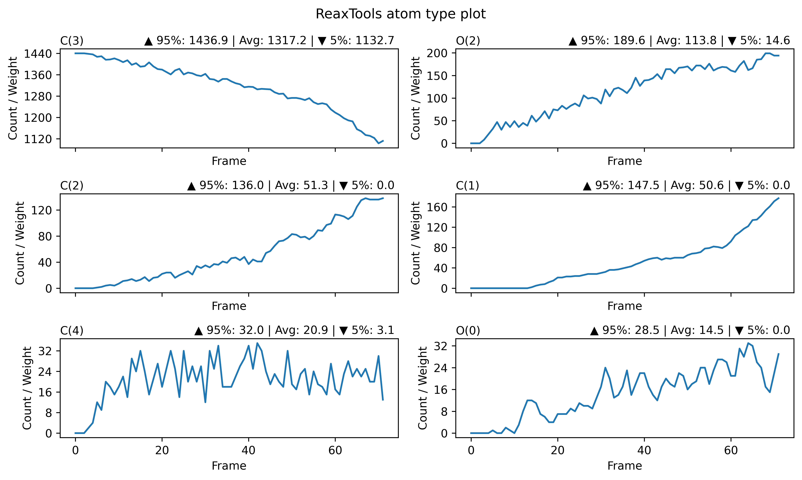
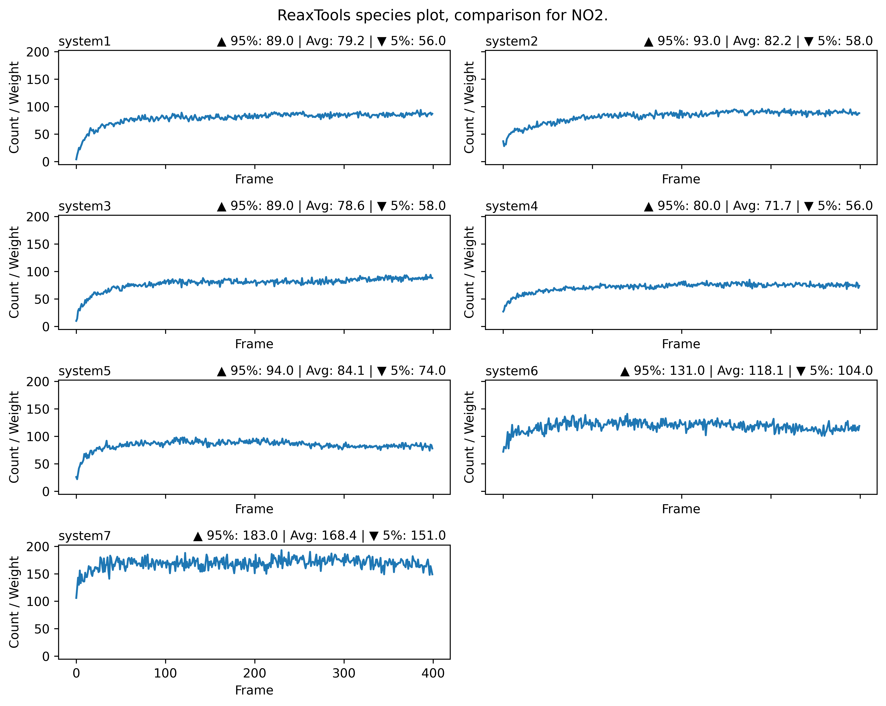
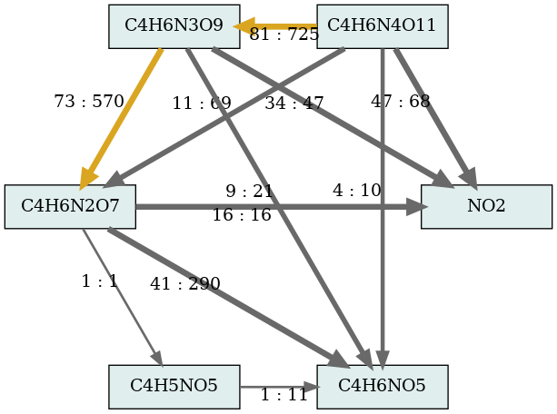
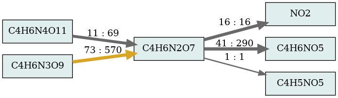
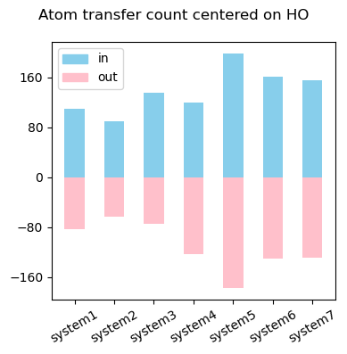

### Automated Reaction Trajectory Analysis with reax_tools  

[English document](README.md) | [中文文档](README_CN.md)

You can now perform all analyses directly via the Web version: [reax_tools_web](http://cc-portal.xyz/reax_tools)

----

### Introduction to reax_tools  

reax_tools is a C++-based post-analysis tool for reactive molecular dynamics trajectories. It supports analyzing trajectories in `lammpstrj` and `xyz` formats, regardless of whether they were generated by ReaxFF, AIMD, or NEP.  

The algorithm is briefly described as follows:  

1. Build neighbor lists  
2. Construct chemical bonds between atoms based on vdW radii (supports 3D periodicity or non-periodic systems)  
3. Search and build molecular topologies  
4. Calculate quantities based on graph connectivity: number of independent 3-8 membered rings, atom bond counts, and species population changes  
5. Construct material transformation networks using inter-frame molecular correlations and atom transfer relationships  

Automatically generated outputs include:  

1. Chemical formulas and counts of species per frame (`species_count.csv`)  
2. Bond types and counts per frame (`bond_count.csv`)  
3. Ring counts per frame (`ring_count.csv`)  
4. Material transformation network (`reactions.dot`)  
5. Key-molecule-centered sub-networks (`reactions_centered_on_*_.dot`) and inflow/outflow data (`key_molecule_reactions.csv`)  

The software is optimized for parallel execution and memory management. No additional setup is required, and it scales to systems with millions of atoms. Processing time is ~2-3 minutes per 1GB of `lammpstrj` trajectory. Minimum recommended configuration: 2-4 core CPU, 4GB RAM.  

Includes a Python plotting script `reax_plot.py` for automated visualization.  

----

### Basic Usage  

#### 1. Download the latest version from GitHub: [https://github.com/tgraphite/reax_tools/releases](https://github.com/tgraphite/reax_tools/releases). Files without extensions are for Linux; `.exe` files are for Windows. **The author recommends using the Linux binary**.  

#### 2. Extract the files, e.g., to `/your/reax_tools/path`  

#### 3. Set `PATH` and `LD_LIBRARY_PATH`:  
    export PATH=${PATH}:/your/reax_tools/path

#### 4. Minimal usage:  
    reax_tools -f <.xyz/.lammpstrj file> -t <element1,element2...> 
    # Example: reax_tools -f traj.lammpstrj -t C,H,O,N
    # For .xyz files with element labels, -t is optional
    

#### 5. File format notes  

Recommended input formats:  

- **LAMMPS `lammpstrj` format** (extension `.lammpstrj`): 

    > Atom records must include `id type x y z` or `id type xs ys zs`. Atom type-to-element mapping must be unique (e.g., type 1-4 = C,H,O,N is valid; type 1-5 = C,H,H,O,N is invalid). Use `-t C,H,O,N` to specify elements.  

- **Extended XYZ format**: 

    > Compatible with CP2K/GPUMD outputs like `traj.pos-1.xyz` and `dump.xyz`. Or exported/converted via OVITO using "XYZ (extended)" with fields `Element X Y Z`. 

**Troubleshooting tip**: 
> Most initial failures stem from file format issues. For non-unique mappings (e.g., type 1-5 = C,H,H,O,N), import into OVITO, assign unique "Particle Type" names, then export as XYZ to merge elements.  

#### 6. Full options  
    -s <lammps species file>  # Replaces -f; cleans LAMMPS ReaxFF/species output (legacy reax_species.py functionality)

    -r <vdw scaling factor>   # vdW radius scaling factor (default: 1.2, matches OVITO). Adjust for sensitivity: lower values fragment molecules more aggressively.

    --dump                    # Output bond-annotated LAMMPS data files per frame for OVITO/VMD visualization (disabled by default)

    -nt <threads>             # Thread count (default: 4). Higher values may not accelerate all algorithms.

    -me <element>             # Merge species groups by element content (e.g., C1-C4, C5-C8). Default: none. If -mr is set without -me, defaults to C.

    -mr <ranges>              # Merge boundaries for -me (left-inclusive, right-exclusive). Default: 1,4,8,16.

    -rc                       # Recalculate merged group weights as atom counts (not molecule counts). Default: disabled.

    --order <elements>        # Element order in output formulas (e.g., H2CO → CH2O). Default: C,H,O,N,S,F,P.

    -rr                       # Retain net reaction flux for reversible pairs. Useful for oversaturated networks.

----

### Graphical Output Files  
reax_tools is a computation-only tool. Plotting uses the bundled `reax_plot.py`:  

    reax_plot.py -d <directory>      # Auto-plot all reax_tools graphical results in a directory
    reax_plot.py -c <file1,file2...> # Compare multiple CSV files (e.g., parallel systems), merging common entries

**reax_plot.py automatically filters trivial results (e.g., near-zero species, stable bonds) and paginates dense plots.**  

Example outputs:  

- **species_count.csv**  
  
`95% | Avg | 5%`: 95th percentile (high), average, and 5th percentile (low) values.  

- **bond_count.csv**  
  

- **ring_count.csv**  
  
`R3-R8`: 3- to 8-membered rings. Ring counts may be irrelevant for metallic systems; mask elements with `-t X` (e.g., `-t X,H,O`) to exclude them.  

- **atom_bonded_num_count.csv**  
  
`C(3)`: Carbon bonded to 3 atoms (≈sp² carbon in organics). `O(2)`: Oxygen bonded to 2 atoms. `H(0)`: Isolated hydrogen.  

- **compare_*.png** (multi-system comparison)  
  
Generated via `python reax_plot.py -c system1_species_count.csv ...`. Only statistically significant shared fields are plotted.  

### Network Output Files  
Reaction networks are stored as graphs (vertices + edges) in `.dot` format. 

Visualize with Graphviz:  

    dot -Tpng reactions.dot -o reactions.png  # Install via apt/yum (apt install graphviz)

Batch processing:  

    for file in *.dot; do
        dot -Tpng $file -o ${file/.dot/.png}
    done

**Note**: Complex networks may take hours to render. In this case, program will make a subgraph `reactions.dot` (key components) for faster plotting and a fullgraph `reactions_full.dot`.  

- **reactions.dot**  
  
`5:10`: 5 reaction occurrences transferring 10 atoms total. High-flux paths are highlighted in yellow.  

**Key insights**:  

> 1. Reactions rarely balance perfectly (e.g., C4H8 → 2×C2H4). Output shows occurrence counts  and total atom transfers. 
> 2. `-rr` eliminates minor reverse fluxes (e.g., H2O ⇌ OH), retaining net values.  
> 3. Network flow analysis (e.g., max flow from C4H6N4O11 to NO2) may be automated in future versions.  

- **reactions_centered_on_*.dot**  
  
Sub-network for key molecules. Annotations same as above.  

- **key_molecules_reactions.csv**  
Quantifies inflow/outflow for key molecules: reaction counts, atom transfers, top 5 sources/sinks.  
  

### Support and Bug Reports  
Report bugs and discussing: QQ Group 561184358  

For paid tech support / consulting: +86 15693074850

### License and Notes  
MIT License — use freely.  

DO NOT SELL the program (especially on ebay/xianyu — you are breaking open-source community!).  