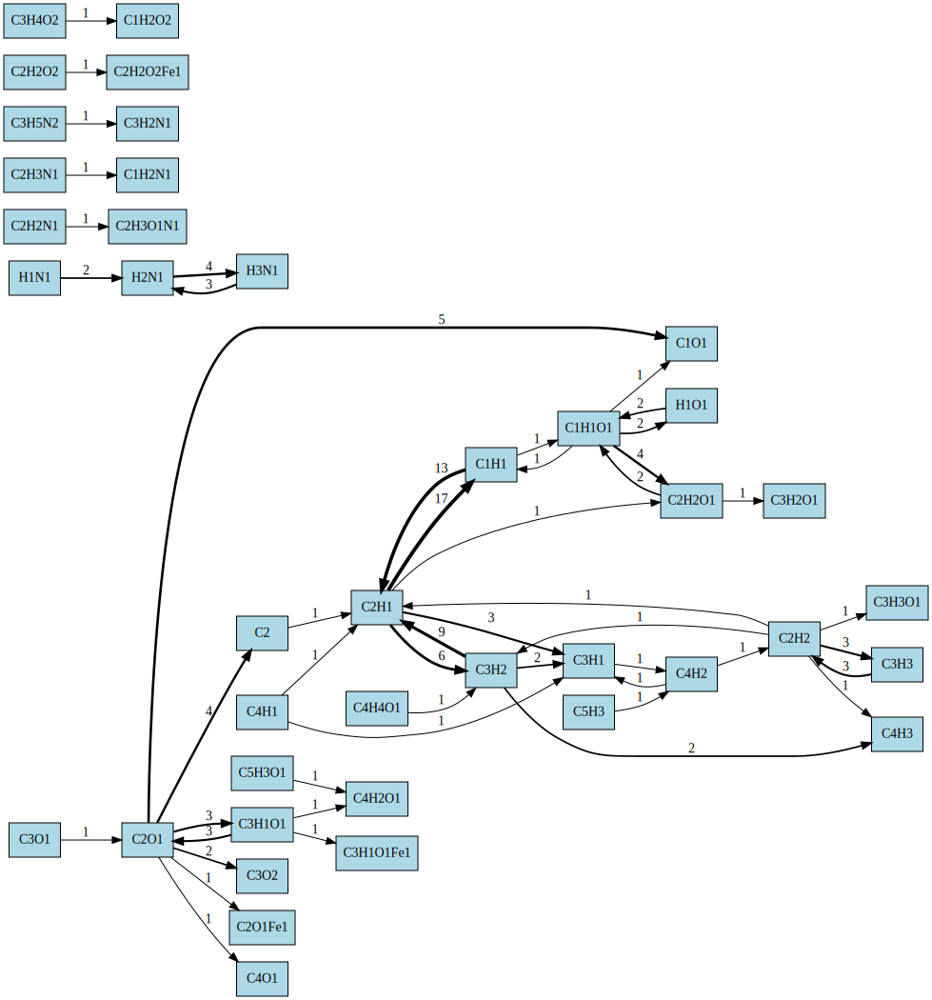

# ReaxTools 1.1 Version
[简体中文](README_zh.md)
(Auto Translated by LLM)

Post-processing for ReaxFF/AIMD simulation trajectories,   generating cleaned species evolution and reaction relationship information.  

Permanent update address: https://github.com/tgraphite/reax_tools  
If it's useful to you, consider starring it on GitHub, which is very important for me to develop the project. Thank you!  


## 1.1 Version Update Notes
---------
- All code is now open source
- Added reaction flowchart functionality, which can trace reaction relationships between molecules
- With the help of Cursor, the lazy author has resumed updates

## Features
-----
- Extremely minimalist tool, no dependencies or installation process required
- Better performance, capable of handling million-atom systems, low-end laptops can process 1GB trajectories within 5-10 minutes, with memory consumption under 200 MB
- Direct trajectory reading function, supports .lammpstrj files and .xyz files (such as pos-1.xyz trajectories produced by CP2K can also be used), generate species csv file.
- Function to clean up the .species.out output from LAMMPS, generate species csv file.
- Practical functions such as customizing bond radius scaling factors, recalculating species weights, organizing molecular groups, and element order
- Generate reaction flow graph (new in ver. 1.1)


[CSV File](examples/FeCHON_5frames.csv)

## Usage
---------
(Enter -h to display this help)
```
-f <.xyz/.lammpstrj file>
// [Read trajectory] Determines bonds using van der Waals radii, establishes molecular topology and analysis

-s <lammps species.out file> 
// (Species) [Read species file] reads the file and cleans it up

-r <value>
// Adjusts the scaling factor of van der Waals radii, default is 1.2 (same as OVITO)
// Increasing this value will make it easier to determine bonding between atoms, making molecules larger. The opposite is also true.

-t <element,element...>
// Comma-separated element names, such as C,H,O,N,S,F (mandatory when reading lammpstrj)
// If you don't want to count a particular element, such as a fixed Fe substrate, you can set its symbol to X.

-me <element>
// Merges species types by the number of atoms of a specified element, e.g., C1~C4 merged into group_C1-C4. The option name is an abbreviation for merge-element.

-mr <range1,range2...>
// Merges species types within specified atomic number ranges, e.g., 1,4,8,16. The option name is an abbreviation for merge-range.
// e.g. -mr 1,4,8,16

-rc 
// Recalculates the weight of species based on the number of atoms specified by -me, such as C2H4 considered as weight 2, not as one molecule. The option name is an abbreviation for recalc.

--order <element,element...>
// Organizes the order of elements in the output chemical formula (default: C,H,O,N,S,F,P)
// e.g. --order C,H,O,N
```
### Examples

Processing an XYZ trajectory containing carbon, hydrogen, oxygen, and nitrogen atoms:

```
./reax_tools -f trajectory.xyz -me C -rc -mr 1,4,6,8
./reax_tools -f trajectory.lammpstrj -t C,H,O,N -r 1.3
```

## Output Files
---------
- .species.csv - Contains molecular species statistics and evolution data
- .dot - Reaction flowcharts, can be visualized with tools like Graphviz

## Test Output
```
Frame: 1 Atoms: 12902 Bonds: 10559 Mols: 5173
Frame: 2 Atoms: 12902 Bonds: 10223 Mols: 5180
Frame: 3 Atoms: 12902 Bonds: 10181 Mols: 5243
Frame: 4 Atoms: 12902 Bonds: 10073 Mols: 5284
Frame: 5 Atoms: 12902 Bonds: 10031 Mols: 5326
C1 : 86 74 95 108 104 
C102H8O44 : 0 0 0 1 0 
C104H8O43 : 0 0 1 0 0 
C10H1O3 : 0 0 0 0 1 
C10H1O4 : 0 0 1 0 1 
C10H1O5 : 0 0 0 0 1 
(...)

Save file ../examples/FeCHON_5frames.csv successfully.
=== Reaction Flow Report ===
Total nodes (species): 40
Total edges (reactions): 49

Top reactions:
1: C2H1 -> C1H1 (count: 17)
2: C1H1 -> C2H1 (count: 13)
3: C3H2 -> C2H1 (count: 9)
4: C2H1 -> C3H2 (count: 6)
5: C2O1 -> C1O1 (count: 5)
6: C2O1 -> C2 (count: 4)
7: C1H1O1 -> C2H2O1 (count: 4)
8: H2N1 -> H3N1 (count: 4)
9: C2H2 -> C3H3 (count: 3)
10: C3H3 -> C2H2 (count: 3)
Reaction flow graph saved to ../examples/FeCHON_5frames.dot
```

## Implementation Details
---------
- Alternating Tick-Tock trajectory reading to save memory and support frame-by-frame analysis
- Efficiently searches for nearby atoms using K-D tree algorithm
- Determines chemical bonds based on van der Waals radii
- Constructs molecular graphs using depth-first search algorithm
- Calculates molecular similarity based on the intersection/union of atom ID sets, tracking reaction relationships

## Future Development Plans (Voting)
-----------
- Reaction Network: Display a complete reaction network.
- Functional Group Transfer: Analyze the transfer of molecular fragments between different molecules. (Achieving high accuracy is difficult)
- Visualization: Can include example Python one-click plotting code.

## Building from Source Code
------
Compiled files already exist in the build directory, or you can directly download from release.  

If you need to build from source, it's the same as other cmake compiled programs.
```
mkdir build
cd build
cmake ..
cmake --build . -j8
```

## License

MIT license, or in other words, do what you want with it, the author won't come knocking, nor should you expect me to fix bugs quickly.